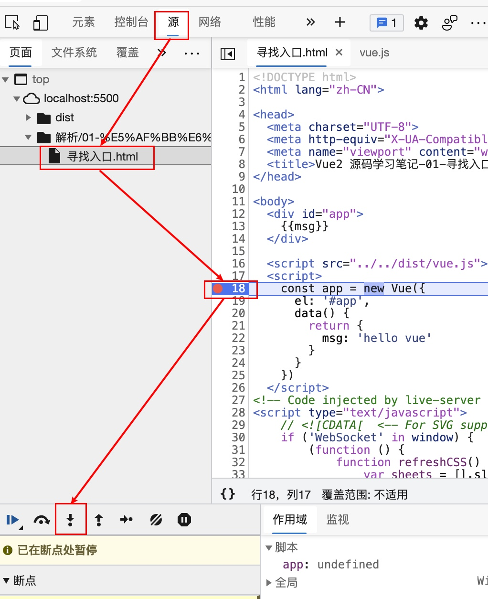
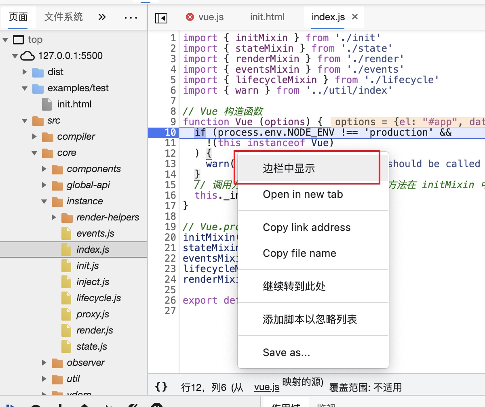

古语云：眼过千遍不如手过一遍。边调试边学习代码，进步更快。

## 预备

### 拉取官方代码

``` bash
git clone https://github.com/vuejs/vue.git
```

### 安装依赖

打开 vue 目录，安装依赖。使用

``` bash
yarn

# 或

npm i

```

### 从 package.json 开始

package.json 乃项目之根本，此文件涵盖项目的配置信息及其依赖包。

在 package.json 中，本次学习主要使用 `script` 字段中的 `dev` 命令:

``` json
"scripts": {
    "dev": "rollup -w -c scripts/config.js --environment TARGET:web-full-dev",
 	// ...
 }
```

此脚本用命令 `rollup` 打包输出完整版 `vue.js` 于 `/dist` 目录。
<!-- 因打包后的 `vue.js` 是压缩过的，故而运行此命令前，需在命令中加上参数 `--sourcemap`，可同时生成映射文件，名为 `vue.js.map`，以便调试时看到原始代码。 -->

<!-- ``` json
"scripts": {
    "dev": "rollup -w -c scripts/config.js --sourcemap --environment TARGET:web-full-dev",
 	// ...
 }
``` -->

运行 Vue 项目，使用

``` bash
yarn dev

# 或

npm run dev
```

随后可在 `/dist` 目录下看到 `vue.js`。

### 寻找入口

在 Vue 项目中，首先会使用 `new Vue()` 创建 Vue 实例，因此欲找寻 Vue 构造函数，可直接编写案例并打断点。

另一种方法是分析 rollup 配置文件一步步找寻，但打断点更直截了当。

案例见本目录：

``` html
<!-- /解析/01-寻找入口/寻找入口.html -->

<html lang="zh_CN">
  <head>
    <!-- ··· -->
    <title>Vue2 源码学习笔记-01-寻找入口</title>
  </head>
  <body>
    <div id="app">
      {{msg}}
    </div>

    <script src="/dist/vue.js"></script>
    <script>
      const app = new Vue({
        el: "#app",
        data() {
          return {
            msg: "hello vue"
          }
        }
      })
    </script>
  </body>
</html>
```

在浏览器中打开当前测试案例，在第 18 行打断点刷新并单步进入：



当前显示的即 Vue 构造函数所在文件：



若想定位当前文件在源码目录中的位置，可如上图，右键选择 `边栏中显示` 即可在左侧看到 Vue 构造函数在 `/src/core/instance/index.js`。

----

至此，入口已寻得。